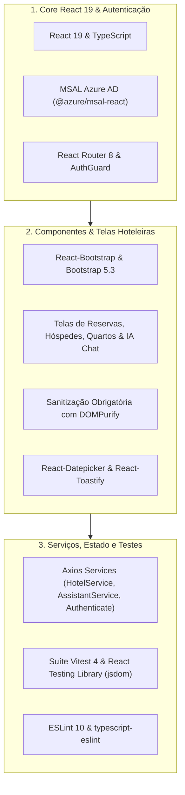

# Diretrizes para Ajuste de Issues e Code Smells — Frontend (HotelWiseUI)

**Documento:** Guia operacional específico da SPA Frontend HotelWiseUI  
**Projeto:** [HotelWiseUI/](file:///c:/git/HotelWise/HotelWiseUI) (`hotelwiseui` — SPA React 19 + TypeScript + Vite 8)  
**Manifesto:** [package.json](file:///c:/git/HotelWise/HotelWiseUI/package.json)  
**Configuração Sonar:** [sonar-project.properties](file:///c:/git/HotelWise/HotelWiseUI/sonar-project.properties)  
**Guia-Base Genérico:** [Diretrizes-CodeSmell-Frontend-Generico.md](file:///c:/git/HotelWise/HotelWiseUI/DOCUMENTACAO/COVERAGE%20AND%20TEST/Diretrizes-CodeSmell-Frontend-Generico.md)  
**Diretrizes de Cobertura:** [Diretrizes-Coverage-Frontend-SmartCoreHub.md](file:///c:/git/HotelWise/HotelWiseUI/DOCUMENTACAO/COVERAGE%20AND%20TEST/Diretrizes-Coverage-Frontend-SmartCoreHub.md)  
**Data da Revisão:** 2026-08-28  

---

## 1. Contexto Arquitetural da Aplicação HotelWiseUI

O **HotelWiseUI** é a Single Page Application (SPA) da plataforma HotelWise, construída sobre **React 19**, **TypeScript**, **Vite 8**, **React-Bootstrap / Bootstrap 5.3**, **React Router 8**, **MSAL (@azure/msal-react / @azure/msal-browser)**, **Axios**, **DOMPurify**, **React Toastify** e **Vitest 4**:



---

## 2. Catálogo de Code Smells Específicos e Saneamento no HotelWiseUI

### 2.1 Gestão de Efeitos, Timers e Prevenção de Memory Leaks (`typescript:S3800` / `react-hooks`)
- **Problema:** Utilizar `useEffect` para carregar dados de reservas, timers de atualização de chat ou listeners de eventos sem cancelar requisições pendentes ou limpar intervalos no unmount.
- **Padrão Homologado no HotelWiseUI:**
  - Sempre utilizar `AbortController` em requisições Axios ou retornar função de cleanup:
    ```typescript
    useEffect(() => {
      const controller = new AbortController();

      const loadHotelData = async () => {
        try {
          const data = await hotelService.getRooms({ signal: controller.signal });
          setRooms(data);
        } catch (error) {
          if (!axios.isCancel(error)) {
            toast.error('Erro ao carregar quartos.');
          }
        }
      };

      loadHotelData();

      return () => {
        controller.abort();
      };
    }, []);
    ```

---

### 2.2 Sanitização Obrigatória contra XSS em Respostas de IA (`typescript:S5147` / `S6096`)
- **Problema:** Renderizar respostas ricas geradas pelo assistente de IA ou conteúdo formatado em HTML diretamente via `dangerouslySetInnerHTML` sem higienização.
- **Padrão Homologado no HotelWiseUI:**
  - Todo HTML dinâmico deve ser sanitizado com **`DOMPurify.sanitize()`**:
    ```typescript
    import DOMPurify from 'dompurify';

    interface SafeHtmlProps {
      htmlContent: string;
    }

    export const SafeHtmlRenderer: React.FC<SafeHtmlProps> = ({ htmlContent }) => {
      const cleanHtml = DOMPurify.sanitize(htmlContent, {
        ALLOWED_TAGS: ['b', 'i', 'em', 'strong', 'a', 'p', 'ul', 'ol', 'li', 'code', 'pre', 'br', 'span'],
        ALLOWED_ATTR: ['href', 'target', 'rel', 'class'],
      });

      return <div dangerouslySetInnerHTML={{ __html: cleanHtml }} />;
    };
    ```

---

### 2.3 Tipagem Estrita em Serviços Axios e DTOs
- **Problema:** Declarar chamadas `axios.get<any>()` ou manipular estados de formulários sem tipagem estrita.
- **Padrão Homologado no HotelWiseUI:**
  - Criar e utilizar contratos de interface dedicados em `src/interfaces/`:
    ```typescript
    import { RoomDto, ReservationFilterDto } from '../interfaces/hotel.interfaces';
    import apiClient from './apiClient';

    export const getRooms = async (filter: ReservationFilterDto): Promise<RoomDto[]> => {
      const response = await apiClient.get<RoomDto[]>('/rooms', { params: filter });
      return response.data;
    };
    ```

---

### 2.4 Isolamento de Autenticação MSAL
- **Problema:** Duplicação de lógica de token acquisition e headers em componentes visuais.
- **Padrão Homologado:**
  - Centralizar a aquisição de tokens e interceptação HTTP nos serviços de autenticação (`src/services/authenticate.ts`, `src/auth-config.ts`), consumindo `@azure/msal-react` via hooks padronizados (`useMsal`).

---

## 3. Configuração Sonar e Exclusões Homologadas

Conforme definido em [sonar-project.properties](file:///c:/git/HotelWise/HotelWiseUI/sonar-project.properties):

```properties
sonar.projectKey=lionscorp_hotelwiseui
sonar.projectName=hotelwiseui
sonar.sources=src
sonar.tests=src
sonar.inclusions=src/**/*.ts,src/**/*.tsx
sonar.exclusions=**/*.js,**/*.spec.ts,**/*test.ts,**/*.css,**/*.scss,**/*.html,**/node_modules/**,**/dist/**,src/tests/**
sonar.test.inclusions=src/**/*.spec.ts,src/**/*.test.ts
sonar.coverage.exclusions=src/**/*.spec.ts,src/**/*.test.ts,src/tests/**
sonar.javascript.lcov.reportPaths=coverage/lcov.info
sonar.typescript.lcov.reportPaths=coverage/lcov.info
```

---

## 4. Procedimento Operacional de Saneamento

```powershell
cd c:\git\HotelWise\HotelWiseUI

# 1. Executar análise estática do ESLint
npm run lint

# 2. Executar validação de compilação TypeScript
npm run build:dev

# 3. Executar suíte de testes unitários e de componentes no Vitest
npm test

# 4. Compilar bundle otimizado de produção
npm run build:prod
```

---

## 5. Checklist de Homologação

- [ ] `npm run lint` concluído com 0 erros e 0 warnings.
- [ ] Compilação TypeScript (`tsc -b`) sem erros de tipagem.
- [ ] Todos os testes unitários e de tela passando no Vitest (`npm test`).
- [ ] Renderizações HTML dinâmicas higienizadas com `DOMPurify.sanitize()`.
- [ ] Links externos com `target="_blank"` contendo `rel="noopener noreferrer"`.
- [ ] `npm run build:prod` gerando os artefatos de produção em `dist/` sem falhas.
- [ ] Quality Gate do SonarCloud aprovado com Rating A.

---

## 6. Referências Internas

- [package.json](file:///c:/git/HotelWise/HotelWiseUI/package.json) — Manifesto de dependências e scripts do HotelWiseUI
- [vitest.config.ts](file:///c:/git/HotelWise/HotelWiseUI/vitest.config.ts) — Configurações da suíte de testes Vitest
- [sonar-project.properties](file:///c:/git/HotelWise/HotelWiseUI/sonar-project.properties) — Configuração do SonarQube/SonarCloud
- [Diretrizes-CodeSmell-Frontend-Generico.md](file:///c:/git/HotelWise/HotelWiseUI/DOCUMENTACAO/COVERAGE%20AND%20TEST/Diretrizes-CodeSmell-Frontend-Generico.md) — Guia genérico de Code Smells frontend
- [Diretrizes-Coverage-Frontend-SmartCoreHub.md](file:///c:/git/HotelWise/HotelWiseUI/DOCUMENTACAO/COVERAGE%20AND%20TEST/Diretrizes-Coverage-Frontend-SmartCoreHub.md) — Diretrizes de cobertura e testes HotelWiseUI
