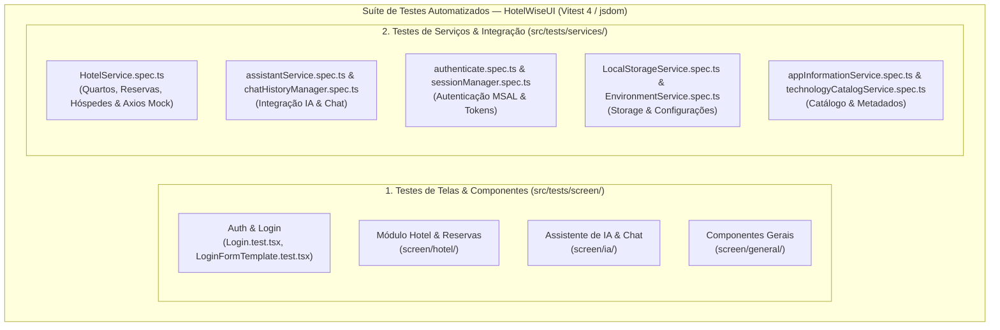

# Diretrizes para Testes Automatizados e Cobertura (Coverage) — Frontend (HotelWiseUI)

**Documento:** Guia operacional específico da suíte de testes e cobertura frontend HotelWiseUI  
**Projeto:** [HotelWiseUI/](file:///c:/git/HotelWise/HotelWiseUI) (`hotelwiseui` — SPA React 19 + TypeScript + Vite 8)  
**Framework de Testes:** **Vitest 4.1+** com `@testing-library/react` e `@testing-library/user-event` (Ambiente `jsdom`)  
**Mecanismo de Cobertura:** `@vitest/coverage-v8` gerando LCOV (`coverage/lcov.info`) e JUnit XML  
**Configuração Sonar:** [sonar-project.properties](file:///c:/git/HotelWise/HotelWiseUI/sonar-project.properties)  
**Configuração Vitest:** [vitest.config.ts](file:///c:/git/HotelWise/HotelWiseUI/vitest.config.ts)  
**Guia-Base Genérico:** [Diretrizes-Coverage-Frontend-Generico.md](file:///c:/git/HotelWise/HotelWiseUI/DOCUMENTACAO/COVERAGE%20AND%20TEST/Diretrizes-Coverage-Frontend-Generico.md)  
**Diretrizes de Code Smells:** [Diretrizes-CodeSmell-HotelWiseUI.md](file:///c:/git/HotelWise/HotelWiseUI/DOCUMENTACAO/COVERAGE%20AND%20TEST/Diretrizes-CodeSmell-HotelWiseUI.md)  
**Data da Revisão:** 2026-08-28  

---

## 1. Mapa da Suíte de Testes do HotelWiseUI

A suíte de testes do **HotelWiseUI** está estruturada em módulos focados em telas interativas (`screen/`) e serviços de comunicação/estado (`services/`):



### 1.1 Detalhamento das Suítes de Teste

| Suíte / Arquivo de Teste | Localização | Foco Principal e Cenários Validados |
| ------------------------ | ----------- | ----------------------------------- |
| **`HotelService.spec.ts`** | `src/tests/services/` | Métodos de listagem, reserva, check-in, check-out e cancelamento com Axios Mock Adapter. |
| **`authenticate.spec.ts`** | `src/tests/services/` | Aquisição de tokens, autenticação MSAL, decodificação JWT e logout seguro. |
| **`assistantService.spec.ts`** | `src/tests/services/` | Envio de prompts ao backend de IA, streaming de respostas e tratamento de indisponibilidade. |
| **`chatHistoryManager.spec.ts`** | `src/tests/services/` | Persistência e recuperação do histórico de conversas do assistente virtual. |
| **`sessionManager.spec.ts`** | `src/tests/services/` | Gerenciamento do ciclo de vida da sessão do operador hoteleiro. |
| **`LocalStorageService.spec.ts`** | `src/tests/services/` | Leitura, escrita e serialização JSON segura no `localStorage`. |
| **`Login.test.tsx`** | `src/tests/screen/` | Renderização do formulário de login, validação de campos obrigatórios e submissão. |
| **`LoginFormTemplate.test.tsx`** | `src/tests/screen/` | Estrutura visual, acessibilidade e responsividade do template de autenticação. |
| **`screen/hotel/*`** | `src/tests/screen/hotel/` | Telas de gestão de quartos, reservas, hóspedes e modais de confirmação. |
| **`screen/ia/*`** | `src/tests/screen/ia/` | Interface do chat de IA, renderização de mensagens sanitizadas e loading states. |

---

## 2. Governança e Configurações de Teste

### 2.1 Configuração Central no `vitest.config.ts`

- **Ambiente:** `jsdom` para emulação do DOM do navegador.
- **Setup Global:** `vitest.setup.ts` importando `@testing-library/jest-dom` e limpando mocks após cada teste (`afterEach`).
- **Mocks de Bibliotecas:** Mocks automáticos para `uuid` e `react-date-picker` em `__mocks__/`.
- **Cobertura V8:** Relatórios gerados em `./coverage` nos formatos:
  - `lcov` (`coverage/lcov.info` para envio ao SonarCloud/SonarQube)
  - `html` (para inspeção visual local em `coverage/index.html`)
  - `junit` (`coverage/junit/test-results.xml` para integração com Azure DevOps / GitHub Actions)

---

## 3. Gestão de Cobertura e Exclusões Homologadas

### 3.1 Exclusões no Sonar e Vitest
Conforme configurado em [sonar-project.properties](file:///c:/git/HotelWise/HotelWiseUI/sonar-project.properties) e [vitest.config.ts](file:///c:/git/HotelWise/HotelWiseUI/vitest.config.ts):

```properties
# Exclusões no Sonar
sonar.coverage.exclusions=src/**/*.spec.ts,src/**/*.test.ts,src/tests/**
```

```typescript
// Exclusões no Vitest Coverage
exclude: [
  'src/**/__tests__/**',
  'src/**/*.{test,spec}.{ts,tsx}',
  'src/**/*.d.ts',
  'src/**/index.tsx',
  'src/**/reportWebVitals.ts',
  'src/**/*.{service,constant,interface,model}.ts',
]
```

### 3.2 Metas de Cobertura Homologadas
- **Statements:** >= 85%
- **Branches:** >= 80%
- **Functions:** >= 85%
- **Lines:** >= 85%
- **Status dos Testes:** 100% de Aprovação (0 falhas)

---

## 4. Procedimento Operacional de Execução

```powershell
cd c:\git\HotelWise\HotelWiseUI

# 1. Executar todos os testes unitários e de tela
npm test

# 2. Executar testes em modo interativo/watch
npm run test:watch

# 3. Executar cobertura de testes e gerar relatório LCOV/HTML
npx vitest run --coverage

# 4. Executar uma suíte específica
npx vitest run src/tests/services/HotelService.spec.ts
```

---

## 5. Checklist de Homologação de Testes

- [ ] Todos os testes executando e passando no Vitest (`npm test`).
- [ ] Novos testes implementados no padrão tripartite `Metodo_Cenario_Resultado` em inglês.
- [ ] Comentários `// Cenário:` e `// Objetivo:` em português adicionados acima de cada teste.
- [ ] Estrutura `// Arrange`, `// Act`, `// Assert` respeitada.
- [ ] Chamadas Axios simuladas via `axios-mock-adapter` ou spies `vi.spyOn`.
- [ ] Relatório `coverage/lcov.info` gerado e íntegro para análise do SonarQube/SonarCloud.
- [ ] Build de produção (`npm run build:prod`) concluído com sucesso.

---

## 6. Referências Internas

- [package.json](file:///c:/git/HotelWise/HotelWiseUI/package.json) — Dependências e scripts do HotelWiseUI
- [vitest.config.ts](file:///c:/git/HotelWise/HotelWiseUI/vitest.config.ts) — Configurações do Vitest
- [sonar-project.properties](file:///c:/git/HotelWise/HotelWiseUI/sonar-project.properties) — Configurações do SonarQube/SonarCloud
- [Diretrizes-Coverage-Frontend-Generico.md](file:///c:/git/HotelWise/HotelWiseUI/DOCUMENTACAO/COVERAGE%20AND%20TEST/Diretrizes-Coverage-Frontend-Generico.md) — Guia genérico de cobertura frontend
- [Diretrizes-CodeSmell-HotelWiseUI.md](file:///c:/git/HotelWise/HotelWiseUI/DOCUMENTACAO/COVERAGE%20AND%20TEST/Diretrizes-CodeSmell-HotelWiseUI.md) — Diretrizes de Code Smells HotelWiseUI
