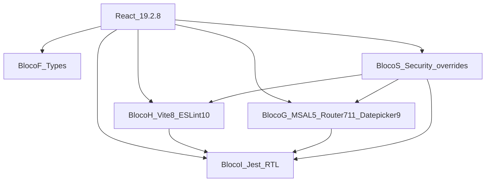

# Levantamento e Conjunto Homologado — HotelWiseUI (React)

**Documento:** Inventário + Conjunto Homologado do ciclo  
**Projeto:** `HotelWiseUI/` (Vite + React + Jest)  
**Data do inventário:** 2026-07-31  
**Node no ambiente:** `v24.16.0` / npm `11.14.1`  
**Processo-base:** `HotelWiseAPI/DOCUMENTACAO/GuiaGenericoAtualizacaoPacotes.md` (blocos F–I npm)  
**Espelho .NET (estrutura):** `HotelWiseAPI/DOCUMENTACAO/API/2026-07-LevantamentoConjuntoHomologado-HotelWiseAPI.md`

---

## 1. Objetivo

Definir o **único conjunto de versões npm** a aplicar no `HotelWiseUI` para:

1. Permanecer na **última versão estável do React** (já alcançada) e alinhar o ecossistema
2. Manter **compatibilidade entre pacotes** (sem `ERESOLVE` / peers quebrados)
3. **Não quebrar** `npm test` (30 suites existentes), `npm run build` e o funcionamento da aplicação
4. **Remediar as 27 vulnerabilidades** reportadas por `npm audit` (2 moderate + 25 high), priorizando produção
5. Documentar travas (TypeScript, `vite-jest`, majors adiadas)

Este documento **não implementa** a atualização — apenas homologa o conjunto. A execução está em `HotelWiseUI/DOCUMENTACAO/UI/PlanoImplementacaoAtualizacaoReact-HotelWiseUI.md`.

---

## 2. Escopo e não escopo

### 2.1 Escopo

| Categoria | Ação |
| --------- | ---- |
| Framework React | Confirmar/manter latest estável; alinhar `@types/react*` |
| Dependências de produção | Conjunto Homologado v1 (Seção 7) |
| Tooling (Vite, ESLint, TypeScript) | Atualizar dentro das travas de peer |
| Stack de testes (Jest + Testing Library + ts-jest) | Família alinhada; **suíte 100% verde** é critério de aceite |
| Segurança npm | Inventário + remediação das 27 vulns (Seção 5); meta: `npm audit --omit=dev` sem high/critical |
| Lockfile | Regenerar e commitar `package-lock.json` junto com `package.json` |
| `.npmrc` / `overrides` | Revisar (legacy-peer-deps + overrides de segurança e vite-jest) |

### 2.2 Não escopo

- Backend `HotelWiseAPI` / NuGet
- Troca de Jest por Vitest (decisão arquitetural separada)
- Remoção obrigatória de `vite-jest` (pacote abandonado; testes usam `ts-jest`)
- TypeScript **7.x** (bloqueado por `typescript-eslint` e `ts-jest` — Conjunto v2)
- Alteração de regras de negócio / contratos de API
- `npm audit fix --force` sem validação de testes (proibido)
- Relatório pós-execução (documento futuro)

---

## 3. Inventário do projeto

| Item | Valor |
| ---- | ----- |
| App | SPA React + Vite (`BrowserRouter` — **não** RSC) |
| Entrada | `src/main.tsx` |
| Auth | `@azure/msal-browser` + `@azure/msal-react` |
| Router | `react-router-dom` v7 |
| UI | Bootstrap 5 + `react-bootstrap` + Font Awesome / Bootstrap Icons |
| Testes | Jest 30 + `ts-jest` + Testing Library + jsdom |
| Suites | **30** arquivos sob `src/tests/` |
| Config teste | `jest.config.ts`, `jest.setup.ts`, mocks em `__mocks__/` |
| Scripts | `dev`/`start`/`run` → vite; `build` → `tsc -b && vite build`; `test` → jest; `lint` → eslint |

**Governança npm hoje:**

- Versões em `package.json` + `package-lock.json`
- `.npmrc`: `legacy-peer-deps=true`
- `overrides` para peers de `vite-jest`
- Sem `engines` declarados

---

## 4. Inventário de dependências (estado atual)

### 4.1 dependencies

| Pacote | Atual | Latest (2026-07-31) |
| ------ | ----- | ------------------- |
| react / react-dom | **19.2.8** | **19.2.8** (já latest) |
| @azure/msal-browser | 4.30.0 | 5.17.3 |
| @azure/msal-react | 3.0.29 | 5.5.4 |
| react-router-dom | **7.18.2** | 7.18.2 (ver CVE Seção 5) |
| react-datepicker | 8.10.0 | 9.1.0 |
| uuid | 12.0.1 | 14.0.1 |
| Demais (bootstrap, axios, msal peers UI, etc.) | ver tabela completa no plano | maioria já latest |

### 4.2 Suíte de testes — mapa completo (deve permanecer verde)

| # | Arquivo | Grupo | Sensível a |
| - | ------- | ----- | ---------- |
| 1 | `src/tests/services/authenticate.spec.ts` | Services | — |
| 2 | `src/tests/services/assistantService.spec.ts` | Services | — |
| 3 | `src/tests/services/chatHistoryManager.spec.ts` | Services | — |
| 4 | `src/tests/services/sessionManager.spec.ts` | Services | — |
| 5 | `src/tests/services/appInformationService.spec.ts` | Services | — |
| 6 | `src/tests/services/EnvironmentService.spec.ts` | Services | — |
| 7 | `src/tests/services/HotelService.spec.ts` | Services | — |
| 8 | `src/tests/services/LocalStorageService.spec.ts` | Services | — |
| 9 | `src/tests/screen/Login.test.tsx` | Auth UI | MSAL 5 |
| 10 | `src/tests/screen/LoginFormTemplate.test.tsx` | Auth UI | — |
| 11 | `src/tests/screen/general/AuthGuard.test.tsx` | Auth / Router | MSAL, react-router |
| 12 | `src/tests/screen/general/AppRoutes.test.tsx` | Router | react-router |
| 13 | `src/tests/screen/general/Navbar.test.tsx` | Router | react-router |
| 14 | `src/tests/screen/general/SinglePage.test.tsx` | Router | react-router |
| 15 | `src/tests/screen/general/NotFound.test.tsx` | Router | react-router |
| 16 | `src/tests/screen/general/AccessDenied.test.tsx` | Router | react-router |
| 17 | `src/tests/screen/general/HeaderPage.test.tsx` | UI | — |
| 18 | `src/tests/screen/general/FooterPage.test.tsx` | UI | — |
| 19 | `src/tests/screen/general/SimpleButton.test.tsx` | UI | — |
| 20 | `src/tests/screen/general/PrivacyPolicy.test.tsx` | UI | — |
| 21 | `src/tests/screen/general/CookieConsent.test.tsx` | UI | — |
| 22 | `src/tests/screen/hotel/HotelList.test.tsx` | Hotel / Router | react-router |
| 23 | `src/tests/screen/hotel/HotelListTemplate.test.tsx` | Hotel | — |
| 24 | `src/tests/screen/hotel/HotelForm.test.tsx` | Hotel / Router / uuid | uuid mock, router |
| 25 | `src/tests/screen/hotel/HotelFormTemplate.test.tsx` | Hotel / uuid | uuid mock |
| 26 | `src/tests/screen/hotel/HotelSearch.test.tsx` | Hotel / uuid | uuid mock |
| 27 | `src/tests/screen/hotel/HotelSearchTemplate.test.tsx` | Hotel | — |
| 28 | `src/tests/screen/ia/Chatbot.test.tsx` | IA | — |
| 29 | `src/tests/screen/ia/ChatbotModal.test.tsx` | IA | — |
| 30 | `src/tests/screen/ia/ChatMessage.test.tsx` | IA | — |

**Gate obrigatório:** `npm test -- --coverage=false --no-cache` → **30/30 suites**, **≥ 104 tests**, **0 failed**.

Mocks que não podem ser removidos sem ajuste:

- `__mocks__/uuid.js` (`v4` fixo)
- `__mocks__/react-date-picker.js`
- `__mocks__/styleMock.js` / `fileMock.js`
- `jest.config.ts` → `moduleNameMapper` para `uuid` e `react-date-picker`

---

## 5. Vulnerabilidades (`npm audit`) — inventário 2026-07-31

### 5.1 Resumo

| Escopo | Contagem | Severidade |
| ------ | -------- | ---------- |
| `npm audit` (all) | **27** | 2 moderate + 25 high |
| `npm audit --omit=dev` (produção) | **2** | 2 high |

**Meta do ciclo:**

1. **Obrigatória:** `npm audit --omit=dev` → **0** high/critical  
2. **Alvo forte:** reduzir as 25 high de dev (eslint/jest/glob) via upgrades + `overrides`  
3. **Proibido:** `npm audit fix --force` sem fase dedicada + testes verdes

### 5.2 Cadeia A — Produção (2 high) — **prioridade 1**

| Pacote | Range vulnerável | Atual no projeto | Advisory | Remediação homologada v1 |
| ------ | ---------------- | ---------------- | -------- | ------------------------- |
| `react-router` | 7.12.0 – 8.2.0 | puxado por `react-router-dom@7.18.2` | [GHSA-qwww-vcr4-c8h2](https://github.com/advisories/GHSA-qwww-vcr4-c8h2) (RSC CSRF) | Pin **`react-router-dom@7.11.0`** (último 7.x **fora** do range CVE). `react-router@8.3.0` já existe, mas **`react-router-dom@8` ainda não** no npm → major 8 adiada |
| `react-router-dom` | ≥ 7.12.0-pre (via peer) | 7.18.2 | mesmo | Idem **7.11.0** |

**Nota de risco residual:** o app é SPA com `BrowserRouter` (não RSC). A CVE cita modo RSC; ainda assim o audit de produção deve ficar limpo. Ao subir para 7.11.0, **reexecutar todos os testes de router** (AppRoutes, AuthGuard, Navbar, HotelList/Form, NotFound, AccessDenied, SinglePage).

Quando `react-router-dom@8.3.x+` (ou patch 7.19+ corrigido) publicar, promover no Conjunto v2 e sair do pin 7.11.0.

### 5.3 Cadeia B — Dev tooling (25 high) — brace-expansion / minimatch / glob

| Pacote raiz | Severidade | Advisory | Onde aparece |
| ----------- | ---------- | -------- | ------------ |
| `brace-expansion` ≤ 5.0.7 | high | GHSA-mh99-v99m-4gvg (DoS OOM) | via `minimatch` → `eslint`, `@eslint/config-array`, `@eslint/eslintrc`, `glob` → **Jest** / `jest-html-reporter` / `test-exclude` / `babel-jest` |

**Remediação homologada v1 (combinar):**

1. Subir **ESLint 10.8.0** (+ `@eslint/js` 10.0.1) — remove parte da cadeia antiga.  
2. Aplicar **`overrides`** transitivos (sem `--force`):

```json
"overrides": {
  "brace-expansion": "^5.0.8",
  "minimatch": "^9.0.5",
  "vite-jest": { "jest": "$jest", "vite": "$vite" }
}
```

> Ajustar `minimatch` para a major que o grafo aceitar após restore (`^9` ou `^10.2.6`). Se `NU`/`ERESOLVE` / testes quebrarem, preferir `brace-expansion@^5.0.8` sozinho e revalidar `npm audit`.

3. Revalidar: `npm audit` e `npm test`.

**Risco residual aceitável só se documentado:** alguma árvore Jest antiga ainda reportar high **apenas em `--include=dev`**, desde que produção esteja limpa e o override de `brace-expansion` esteja aplicado.

### 5.4 Cadeia C — Moderate (2) — uuid em jest-junit

| Pacote | Severidade | Advisory | Remediação |
| ------ | ---------- | -------- | ---------- |
| `uuid` &lt; 11.1.1 (nested em `jest-junit@16`) | moderate | GHSA-w5hq-g745-h8pq | Subir **`jest-junit@17.0.0`** |
| (direto) `uuid@12` no app | — | — | Subir app para **`uuid@14.0.1`** (também fecha bounds check na dep direta) |

### 5.5 Ordem de remediação (sem `--force`)

```text
1. react-router-dom@7.11.0          → limpa audit --omit=dev
2. jest-junit@17 + uuid@14         → fecha moderate uuid
3. eslint@10 + overrides brace-expansion/minimatch → reduz high de dev
4. npm audit / npm audit --omit=dev → evidência no relatório
5. npm test (30/30) após cada passo
```

---

## 6. Problemas e travas detectados

| ID | Problema | Tratamento no Conjunto v1 |
| -- | -------- | ------------------------- |
| U1 | React já 19.2.8 | Manter |
| U2 | MSAL 3/4 → 5 | Browser **5.17.3** + React pkg **5.5.4** juntos |
| U3–U4 | TS 7 bloqueado | TypeScript **~5.9.3** |
| U5 | vite-jest abandonado | overrides + legacy-peer-deps; não usar no Jest config |
| U6 | Vite 8 major | Fase dedicada + build/test |
| U7 | datepicker 9 precisa `date-fns-tz` | Adicionar **3.2.0** |
| U8 | uuid 14 + mock Jest | Atualizar mock se necessário |
| U9 | Node engines Vite 8 | Declarar engines |
| U10 | **27 vulns npm** | Seção 5 — pin router 7.11.0 + overrides + jest-junit 17 |
| U11 | Testes existentes são a rede de segurança | Gate 30/30 em **toda** fase |

---

## 7. Conjunto Homologado v1 — versões a aplicar

### 7.1 Grafo



### 7.2 Dependências rígidas

| Se usar | Então obrigatoriamente |
| ------- | ---------------------- |
| react **19.2.8** | react-dom **19.2.8** + types 19 |
| msal-react **5.5.4** | msal-browser **^5.17.3** |
| vite **8.x** | plugin-react **6.x**; Node **^20.19 \|\| >=22.12** |
| typescript-eslint **8** | TypeScript **&lt; 6.1** → **5.9.3** |
| react-datepicker **9** | date-fns-tz **^3** |
| Fechar CVE router | react-router-dom **7.11.0** (até patch 7.19+/8.x dom) |
| Fechar brace-expansion | override **^5.0.8** e/ou ESLint 10 |

### 7.3 Bloco F — React

| Pacote | Aplicar |
| ------ | ------- |
| react / react-dom | **19.2.8** |
| @types/react / react-dom | **19.2.18** / **19.2.4** |

### 7.4 Bloco G — UI / Auth / Router

| Pacote | Atual | **Aplicar** | Justificativa |
| ------ | ----- | ----------- | ------------- |
| @azure/msal-browser | 4.30.0 | **5.17.3** | Peer MSAL React 5 |
| @azure/msal-react | 3.0.29 | **5.5.4** | React ^19.2.1 |
| react-router-dom | 7.18.2 | **7.11.0** | Sai do range CVE GHSA-qwww-vcr4-c8h2 |
| react-datepicker | 8.10.0 | **9.1.0** | Latest major compatível |
| date-fns-tz | — | **3.2.0** | Peer datepicker 9 |
| uuid | 12.0.1 | **14.0.1** | Latest + advisory uuid |

### 7.5 Bloco H — Build / lint

| Pacote | **Aplicar** |
| ------ | ----------- |
| vite | **8.2.0** |
| @vitejs/plugin-react | **6.0.5** |
| typescript | **~5.9.3** |
| eslint / @eslint/js | **10.8.0** / **10.0.1** |
| eslint-plugin-react-hooks / refresh | **7.1.1** / **0.5.3** |
| globals | **17.8.0** |
| typescript-eslint | **8.65.0** |

### 7.6 Bloco I — Testes

| Pacote | **Aplicar** |
| ------ | ----------- |
| jest / jest-environment-jsdom | **30.4.2** / **30.4.1** |
| @testing-library/jest-dom | **7.0.0** |
| jest-junit | **17.0.0** |
| demais RTL / ts-jest / vite-jest | conforme plano |

### 7.7 Bloco S — Overrides de segurança (obrigatório no v1)

```json
{
  "overrides": {
    "brace-expansion": "^5.0.8",
    "vite-jest": {
      "jest": "$jest",
      "vite": "$vite"
    }
  }
}
```

Incluir `minimatch` em override **somente** se o audit pós-ESLint 10 ainda reportar high e o restore/testes permanecerem verdes.

### 7.8 Amostra `package.json` (trechos)

```json
{
  "engines": { "node": "^20.19.0 || >=22.12.0" },
  "dependencies": {
    "react": "^19.2.8",
    "react-dom": "^19.2.8",
    "@azure/msal-browser": "^5.17.3",
    "@azure/msal-react": "^5.5.4",
    "react-router-dom": "7.11.0",
    "react-datepicker": "^9.1.0",
    "date-fns-tz": "^3.2.0",
    "uuid": "^14.0.1"
  },
  "devDependencies": {
    "vite": "^8.2.0",
    "@vitejs/plugin-react": "^6.0.5",
    "typescript": "~5.9.3",
    "eslint": "^10.8.0",
    "@eslint/js": "^10.0.1",
    "@testing-library/jest-dom": "^7.0.0",
    "jest-junit": "^17.0.0"
  },
  "overrides": {
    "brace-expansion": "^5.0.8",
    "vite-jest": { "jest": "$jest", "vite": "$vite" }
  }
}
```

`react-router-dom` pinado **sem** `^` até existir versão patched na linha desejada.

---

## 8. O que **não** aplicar no v1

| Tentativa | Motivo | Correto |
| --------- | ------ | ------- |
| TypeScript 7 | Peers eslint/ts-jest | ~5.9.3 |
| `npm audit fix --force` | Majors não homologadas | Passos da Seção 5.5 |
| Manter react-router-dom **7.18.2** | CVE produção | **7.11.0** |
| Rebaixar Jest a 27 por vite-jest | Quebra testes | Jest 30 + overrides |
| Remover mocks uuid/date-picker | Quebra suites | Manter/ajustar |
| react-router **8.3** sem react-router-dom 8 | Grafo inconsistente | Esperar DOM 8 ou pin 7.11.0 |

---

## 9. Conjunto Homologado v2 — futuro

| Item | v1 | v2 |
| ---- | -- | -- |
| react-router-dom | 7.11.0 (pin CVE) | ≥ patched (7.19+ ou 8.3+ DOM) |
| typescript | 5.9.3 | 6/7 quando peers liberarem |
| vite-jest | 0.1.4 + overrides | Remover / Vitest |
| high restantes só em dev | overrides | Remover quando Jest/glob atualizarem |

---

## 10. Evidências do inventário

```text
npm outdated / npm audit / npm audit --omit=dev
Data: 2026-07-31
react: 19.2.8 (= latest)
Vulns all: 27 (2 moderate, 25 high)
Vulns prod: 2 high (react-router / react-router-dom)
Baseline testes: 30 suites / ≥104 tests (revalidar Fase 0)
```

---

## 11. Próximo passo

Executar **`HotelWiseUI/DOCUMENTACAO/UI/PlanoImplementacaoAtualizacaoReact-HotelWiseUI.md`** (fases detalhadas, matriz de testes e remediação de vulns).
