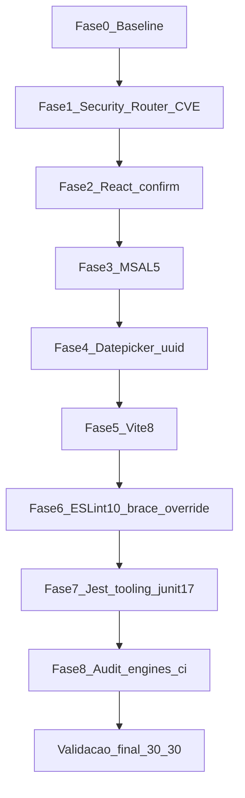

# Plano de Implementação — Atualização HotelWiseUI (React + testes + segurança)

**Documento:** Plano operacional executável (detalhado)  
**Projeto:** `HotelWiseUI/`  
**Conjunto Homologado:** `HotelWiseUI/DOCUMENTACAO/UI/2026-07-LevantamentoConjuntoHomologado-HotelWiseUI.md`  
**Processo-base:** `HotelWiseAPI/DOCUMENTACAO/GuiaGenericoAtualizacaoPacotes.md`  
**Data:** 2026-07-31

---

## 1. Objetivo

Executar a atualização do `HotelWiseUI` para o **Conjunto Homologado v1**, com três prioridades **nesta ordem**:

1. **Testes existentes 100% verdes** (30 suites / ≥ 104 tests) — não avançar fase se falhar  
2. **Remediar vulnerabilidades** (`npm audit`: 27 = 2 moderate + 25 high; produção: 2 high)  
3. Atualizar ecossistema (MSAL 5, Vite 8, ESLint 10, etc.) mantendo React **19.2.8**

**Não** é objetivo: Vitest, TypeScript 7, redesign, mudança de contratos de API, `npm audit fix --force` cego.

---

## 2. Escopo e não escopo

### 2.1 Escopo

| Categoria | Ação |
| --------- | ---- |
| Segurança | Fechar CVE produção (react-router); reduzir high de brace-expansion; uuid via jest-junit 17 + uuid 14 |
| Testes | Gate em toda fase; matriz arquivo ↔ fase |
| Bloco F–I | Conjunto v1 |
| Config | `vite.config.ts`, `eslint.config.js`, `jest.config.ts` / mocks só se necessário |
| Lockfile + engines | Commit conjunto; declarar Node |

### 2.2 Não escopo

- HotelWiseAPI  
- TypeScript 7 / Vitest  
- Remoção forçada de `vite-jest`  
- `npm audit fix --force` sem validação  

---

## 3. Pré-requisitos e baseline

| Item | Valor |
| ---- | ----- |
| Branch | `chore/update-packages-hotelwiseui-react` |
| Node | `^20.19.0 \|\| >=22.12.0` |
| Versões | Somente Conjunto Homologado v1 |

```powershell
cd HotelWiseUI
node --version
npm ci
npm audit
npm audit --omit=dev
npm test -- --coverage=false --no-cache
npm run build
```

**Registrar baseline (obrigatório):**

```text
Suites: __ / 30
Tests: __ / __
Build: OK/FAIL
npm audit: 27 (2 moderate, 25 high)
npm audit --omit=dev: 2 high
```

---

## 4. Regra de ouro da execução

Após **cada** fase:

```powershell
npm test -- --coverage=false --no-cache
npm run build
```

Critério mínimo: **0 failed**. Se falhar → corrigir na fase ou `git checkout --` dos arquivos da fase e não avançar.

Comando útil para subset crítico de router/auth:

```powershell
npm test -- --coverage=false --no-cache src/tests/screen/general/AppRoutes.test.tsx src/tests/screen/general/AuthGuard.test.tsx src/tests/screen/Login.test.tsx src/tests/screen/hotel/HotelForm.test.tsx src/tests/screen/hotel/HotelList.test.tsx
```

---

## 5. Plano por fases (detalhado)



---

### Fase 0 — Baseline

1. Criar branch.  
2. `npm ci` + audit + test + build.  
3. Anotar números da Seção 3.  
4. Commit opcional: `chore(ui): baseline before react ecosystem update`.

**Saída:** baseline documentada; testes verdes no estado atual.

---

### Fase 1 — Segurança produção (react-router CVE) — **fechada com v8**

Advisory: [GHSA-qwww-vcr4-c8h2](https://github.com/advisories/GHSA-qwww-vcr4-c8h2). **Final:** `react-router@^8.3.0` + remoção de `react-router-dom` (API unificada no v8).

```powershell
npm install react-router@8.3.0
npm uninstall react-router-dom
# trocar imports: from 'react-router-dom' → from 'react-router'
```

**Jest:** transformar ESM (`transformIgnorePatterns` + `babel.config.cjs` para `import.meta`).

**Critério de saída:**

- [x] `npm audit --omit=dev` → **0**  
- [x] 30/30 suites  
- [x] build OK  

Ver `RelatorioAtualizacaoReact-HotelWiseUI.md`.

---

### Fase 2 — Bloco F (React)

Confirmar / pinuar:

```json
"react": "^19.2.8",
"react-dom": "^19.2.8",
"@types/react": "^19.2.18",
"@types/react-dom": "^19.2.4"
```

```powershell
npm install react@19.2.8 react-dom@19.2.8
npm test -- --coverage=false --no-cache
npm run build
```

**Saída:** React permanece latest; testes verdes.

---

### Fase 3 — MSAL 5 (auth)

```powershell
npm install @azure/msal-browser@5.17.3 @azure/msal-react@5.5.4
```

**Implementação — checklist de código:**

| Arquivo | O que verificar |
| ------- | --------------- |
| `src/auth-config.ts` | `Configuration` ainda válida |
| `src/main.tsx` | `PublicClientApplication`, `MsalProvider` |
| `src/services/AzureAuthService.ts` | `loginPopup`/`acquireToken`/`AccountInfo` |
| `src/components/general/Login.tsx` | `useMsal` |
| `src/components/general/Callback.tsx` | redirect / handleRedirectPromise |

Se a API MSAL 5 exigir mudanças (ex.: imports ou opções de cache), aplicar o **mínimo** para compilar e passar testes — sem refatorar fluxo de negócio.

**Testes:**

| Suite | Motivo |
| ----- | ------ |
| `Login.test.tsx` | formulário + redirect token |
| `AuthGuard.test.tsx` | guarda |
| Demais 30 | regressão geral |

Smoke manual: login Entra + callback (com `appsettings`/env locais válidos).

```powershell
npm test -- --coverage=false --no-cache
npm run build
```

**Saída:** compile + 30/30 + smoke auth OK.

---

### Fase 4 — Datepicker 9 + uuid 14

```powershell
npm install react-datepicker@9.1.0 date-fns-tz@3.2.0
npm install uuid@14.0.1
```

**Implementação:**

1. Confirmar import CSS em `RoomAvailabilityManagementTemplate.tsx` (`react-datepicker/dist/react-datepicker.css`).  
2. Código usa `import { v4 as uuidv4 } from 'uuid'` em `HotelFormTemplate.tsx` / `HotelSearchTemplate.tsx` — deve continuar válido.  
3. Ajustar `__mocks__/uuid.js` se Jest deixar de resolver CJS:

```js
module.exports = { v4: () => '00000000-0000-4000-8000-000000000000' };
```

Se ESM puro falhar, manter `moduleNameMapper` em `jest.config.ts` apontando para o mock.

**Testes críticos:**

| Suite | Motivo |
| ----- | ------ |
| `HotelFormTemplate.test.tsx` | tags/uuid keys |
| `HotelForm.test.tsx` | form + router |
| `HotelSearch.test.tsx` | uuid mock |

```powershell
npm test -- --coverage=false --no-cache
npm run build
```

**Saída:** 30/30; sem novos failures (warnings de key duplicada do mock uuid são conhecidos).

---

### Fase 5 — Vite 8 + plugin-react 6

```powershell
npm install -D vite@8.2.0 @vitejs/plugin-react@6.0.5
```

**Implementação:**

1. Abrir `vite.config.ts` — manter `vite-plugin-environment` e `@vitejs/plugin-react`.  
2. Se o build falhar, seguir [Vite 8 migration](https://vite.dev/blog/announcing-vite8) (compat layer Rolldown primeiro; só então ajustar opções).  
3. Não alterar TS para 7.

```powershell
npm run build
npm run build:prod
npm test -- --coverage=false --no-cache
npm run dev
```

**Saída:** dist OK; app sobe; 30/30.

---

### Fase 6 — ESLint 10 + override brace-expansion (25 high de dev)

```powershell
npm install -D eslint@10.8.0 @eslint/js@10.0.1 eslint-plugin-react-hooks@7.1.1 eslint-plugin-react-refresh@0.5.3 globals@17.8.0
```

No `package.json`, garantir overrides:

```json
"overrides": {
  "brace-expansion": "^5.0.8",
  "vite-jest": { "jest": "$jest", "vite": "$vite" }
}
```

```powershell
Remove-Item -Recurse -Force node_modules
npm install
npm run lint
npm audit
npm test -- --coverage=false --no-cache
npm run build
```

**Implementação ESLint:**

- Revisar `eslint.config.js` (flat config).  
- Corrigir apenas erros que bloqueiam CI; não reformatar o repo inteiro.  
- Se `brace-expansion` override quebrar alguma ferramenta, testar override só em `eslint/**/brace-expansion` via nested override; documentar desvio.

**Saída:** lint OK; audit de produção ainda limpo; high de all reduzidos; 30/30.

---

### Fase 7 — Tooling de teste (jest-dom 7 + jest-junit 17)

Fecha moderate uuid aninhado em jest-junit 16.

```powershell
npm install -D @testing-library/jest-dom@7.0.0 jest-junit@17.0.0
```

1. Conferir `jest.setup.ts` (import `@testing-library/jest-dom`).  
2. Conferir reporters em `jest.config.ts` (`jest-junit`, `jest-html-reporter`).  
3. Manter `vite-jest` + `.npmrc` `legacy-peer-deps=true`.

```powershell
npm test -- --coverage=false --no-cache
npm audit
```

**Saída:** 30/30; moderate uuid de jest-junit ausente.

---

### Fase 8 — Audit final, engines, CI, limpeza

1. `package.json` → engines:

```json
"engines": { "node": "^20.19.0 || >=22.12.0" }
```

2. Evidências de segurança:

```powershell
npm audit --omit=dev
npm audit
```

Metas:

| Check | Meta |
| ----- | ---- |
| `audit --omit=dev` | **0** high/critical |
| `audit` (all) | 0 high ideal; residual só se for transitivo Jest sem fix estável — **listar no relatório** |

3. Reinstall limpo:

```powershell
Remove-Item -Recurse -Force node_modules
npm ci
npm test -- --coverage=false --no-cache
npm run build
npm run lint
```

4. Atualizar README (Node/React) se necessário; anotar pipeline Node ≥ 20.19.

**Saída:** `npm ci` reproduzível; gates verdes; audit produção limpo.

---

## 6. Matriz fase × suites (resumo)

| Fase | Suites que devem ser revalidadas com atenção |
| ---- | --------------------------------------------- |
| 1 Router CVE | AppRoutes, AuthGuard, Navbar, SinglePage, NotFound, AccessDenied, HotelList, HotelForm, Login |
| 3 MSAL | Login, AuthGuard + suíte completa |
| 4 uuid/datepicker | HotelForm*, HotelSearch*, RoomAvailability (smoke) |
| 5 Vite | suíte completa + build (Jest não usa Vite, mas regressão geral) |
| 6 ESLint/overrides | suíte completa (glob/minimatch no Jest) |
| 7 jest-dom/junit | suíte completa + artefatos junit/html |

---

## 7. Checklist de validação final

### 7.1 Install

- [ ] `npm ci` OK  
- [ ] lockfile sincronizado  

### 7.2 Testes (obrigatório — critério de aceite #1)

```powershell
npm test -- --coverage=false --no-cache
```

- [ ] **30/30** suites passed  
- [ ] **0** failed  
- [ ] Contagem de tests ≥ baseline (≥ 104)  

### 7.3 Segurança (critério de aceite #2)

```powershell
npm audit --omit=dev
npm audit
```

- [x] Produção: **0** high/critical  
- [x] `react-router` = **8.3.0** (`react-router-dom` removido)  
- [x] `brace-expansion` override **^5.0.8** aplicado  
- [x] `jest-junit` **17** / `uuid` app **14**  
- [x] Residual all-dev documentado (se houver)  

### 7.4 Build / lint / smoke

- [ ] `npm run build` / `build:prod` OK  
- [ ] `npm run lint` OK  
- [ ] `npm run dev` — app, login MSAL, hotéis, datepicker, chatbot  

### 7.5 Versões-chave

```powershell
npm ls react react-dom react-router-dom vite @azure/msal-react @azure/msal-browser typescript --depth=0
```

- [x] react **19.2.8**  
- [x] react-router **8.3.0**  
- [x] msal **5.x**  
- [x] vite **8.x**  
- [x] typescript **5.9.x**  

---

## 8. Critérios de aceite

1. **Todos os testes existentes passam** (30/30).  
2. **`npm audit --omit=dev` limpo** de high/critical.  
3. React permanece **19.2.8**.  
4. Conjunto Homologado v1 + **migração router 8.3.0**.  
5. Build prod + lint + smoke OK.  
6. TypeScript não sobe para 7.  
7. Sem `audit fix --force` não validado.  
8. `package.json` + `package-lock.json` juntos.

---

## 9. Rollback

```powershell
git reset --hard <commit-baseline-fase-0>
cd HotelWiseUI
npm ci
npm test -- --coverage=false --no-cache
npm run build
npm audit --omit=dev
```

Restaurar juntos: `package.json`, `package-lock.json`, `.npmrc`, configs Jest/Vite/ESLint.

---

## 10. Riscos e mitigações

| Risco | Mitigação |
| ----- | --------- |
| Pin router 7.11.0 piora highs ≤7.17 | Manter **7.18.2**; documentar residual audit stale; Conjunto v2 = DOM 8 |
| MSAL 5 quebra login | Fase 3 isolada + Login/AuthGuard + smoke |
| Vite 8 quebra build | Fase 5 isolada; migration guide; rollback bloco |
| Override brace-expansion quebra Jest | Revalidar Fase 6 com suíte completa; afrouxar override se preciso e documentar |
| uuid 14 + Jest ESM | Manter mock + moduleNameMapper |
| 25 high não zeram 100% no all | Meta mínima é produção limpa; residual dev no relatório |

---

## 11. Ordem de commits sugerida

1. `chore(ui): baseline before ecosystem update`  
2. `fix(ui): keep react-router-dom 7.18.2 as GHSA-qwww v7 patch`  
3. `chore(ui): upgrade MSAL browser/react to v5`  
4. `chore(ui): upgrade react-datepicker 9, date-fns-tz and uuid 14`  
5. `chore(ui): upgrade Vite 8 and plugin-react 6`  
6. `chore(ui): upgrade ESLint 10 and override brace-expansion`  
7. `chore(ui): upgrade jest-dom 7 and jest-junit 17`  
8. `chore(ui): declare engines and document audit results`  

Só commitar quando o responsável pedir.

---

## 12. Evidências (relatório)

Gerado: `HotelWiseUI/DOCUMENTACAO/UI/RelatorioAtualizacaoReact-HotelWiseUI.md`

```text
React: 19.2.8
react-router: 8.3.0 (react-router-dom removido; CVE prod fechada)
Testes: 30/30 suites, 104/104 tests
npm audit --omit=dev: 0
npm audit all: 0
Build/lint/smoke: OK
```

---

## 13. Referências

- `HotelWiseUI/DOCUMENTACAO/UI/2026-07-LevantamentoConjuntoHomologado-HotelWiseUI.md`  
- [GHSA-qwww-vcr4-c8h2](https://github.com/advisories/GHSA-qwww-vcr4-c8h2) (react-router)  
- [GHSA-mh99-v99m-4gvg](https://github.com/advisories/GHSA-mh99-v99m-4gvg) (brace-expansion)  
- [GHSA-w5hq-g745-h8pq](https://github.com/advisories/GHSA-w5hq-g745-h8pq) (uuid)  
- https://vite.dev/blog/announcing-vite8  
