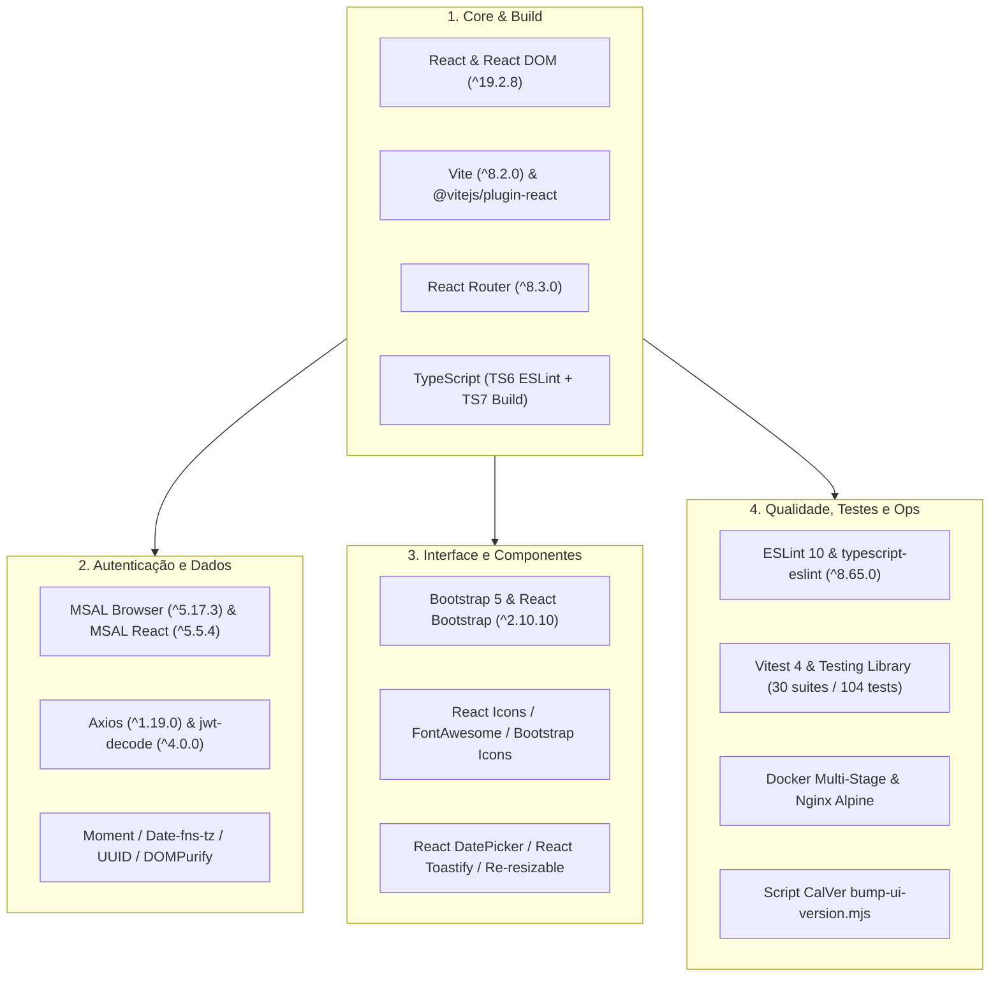
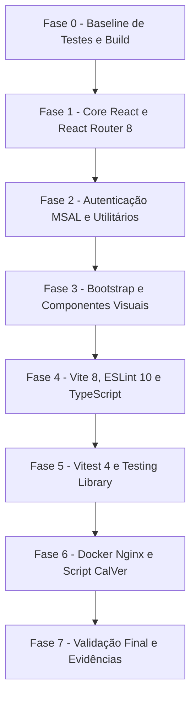

# Guia de Atualização de Pacotes — HotelWiseUI

**Documento:** Guia operacional específico da aplicação frontend  
**Projeto:** [HotelWiseUI](file:///c:/git/HotelWise/HotelWiseUI) (SPA React + Vite + TypeScript)  
**Manifesto:** [package.json](file:///c:/git/HotelWise/HotelWiseUI/package.json)  
**Lockfile:** [package-lock.json](file:///c:/git/HotelWise/HotelWiseUI/package-lock.json)  
**Engines Node:** `^20.19.0 || >=22.12.0`  
**Guia Base Genérico:** [GuiaGenericoAtualizacaoPacotesFrontend.md](file:///c:/git/HotelWise/HotelWiseUI/DOCUMENTACAO/UpdatePackages/GuiaGenericoAtualizacaoPacotesFrontend.md)  
**Backend Companion:** [HotelWiseAPI](https://github.com/LeoneRocha/HotelWiseAPI)  
**Data:** 2026-08-22  

---

## 1. Contexto Arquitetural do Projeto

O **HotelWiseUI** é a interface web SPA da plataforma HotelWise, construída sobre **React 19.2**, empacotada via **Vite 8** e com testes automatizados executados pelo **Vitest 4**. A aplicação consome a API REST [HotelWiseAPI](https://github.com/LeoneRocha/HotelWiseAPI) e implementa autenticação local via JWT combinada com suporte a **Microsoft Entra ID** através da biblioteca MSAL v5.



---

## 2. Escopo e Não Escopo

### 2.1 Escopo

- Atualização controlada das dependências diretas e de desenvolvimento no [package.json](file:///c:/git/HotelWise/HotelWiseUI/package.json).
- Preservação da compatibilidade com o backend [HotelWiseAPI](https://github.com/LeoneRocha/HotelWiseAPI) através das variáveis de ambiente `.env*` (`VITE_API_BASE_URL`).
- Manutenção da suíte de testes Vitest (30 suites / 104 testes unitários e de integração 100% aprovados).
- Manutenção do mecanismo de build side-by-side de TypeScript (TypeScript 6 para ESLint e `typescript7` para `tsc -b` no build).
- Manutenção da integridade de deploy via container Docker multi-stage ([Dockerfile](file:///c:/git/HotelWise/HotelWiseUI/Dockerfile) com Nginx).
- Saneamento de vulnerabilidades através de `npm audit --omit=dev`.

### 2.2 Não Escopo

- Alterações no backend `HotelWiseAPI` (tratado no ciclo do repositório correspondente).
- Redesenho de telas ou alterações visuais de layout sem relação com atualização de pacotes.
- Troca de framework de testes (Vitest é a stack oficial consolidada).
- Alteração de regras de negócio ou contratos de integração de endpoints de API.

---

## 3. Governança de Dependências do HotelWiseUI

A governança de pacotes no HotelWiseUI segue regras estritas para evitar conflitos de peer dependencies e garantir builds determinísticos:

1. **Roteamento Moderno (React Router 8):**
   - O pacote legado `react-router-dom` foi **removido**.
   - Todos os imports de roteamento são realizados exclusivamente a partir de `react-router` (ex.: `import { useNavigate, useLocation } from 'react-router';`).
2. **Estratégia TypeScript Side-by-Side:**
   - **`typescript` principal (`^6.0.3`):** Utilizado pelo `typescript-eslint` para análise estática e validação de linter sem conflitos de peer.
   - **`typescript7` alias (`npm:typescript@^7.0.2`):** Utilizado nos scripts de build (`npm run build`, `npm run build:prod`) para execução do `tsc -b` com suporte à versão 7.x do TypeScript.
3. **Padrão de Mocks no Vitest:**
   - Todos os mocks de serviços em testes ESM utilizam a estrutura `default: { ... }` para compatibilidade com o runtime do Vitest.
   - Aliases obrigatórios configurados no [vitest.config.ts](file:///c:/git/HotelWise/HotelWiseUI/vitest.config.ts) para `^uuid$` e `^react-date-picker$`.
4. **Versionamento Automático por CalVer:**
   - O script [scripts/bump-ui-version.mjs](file:///c:/git/HotelWise/HotelWiseUI/scripts/bump-ui-version.mjs) injeta a versão no formato `YYYY.MM.DD.N` na variável `VITE_UI_VERSION` durante as etapas de build de artefato.

---

## 4. Blocos Estruturais Homologados

### Bloco A — Core Framework & Roteamento
- `react` (`^19.2.8`), `react-dom` (`^19.2.8`)
- `@types/react` (`^19.2.18`), `@types/react-dom` (`^19.2.4`)
- `react-router` (`^8.3.0`)

### Bloco B — Autenticação, Estado e Utilitários
- `@azure/msal-browser` (`^5.17.3`), `@azure/msal-react` (`^5.5.4`)
- `jwt-decode` (`^4.0.0`), `dompurify` (`^3.4.12`)
- `axios` (`^1.19.0`), `uuid` (`^14.0.1`)
- `moment` (`^2.30.1`), `moment-timezone` (`^0.6.3`), `date-fns-tz` (`^3.2.0`)

### Bloco C — Interface, Componentes e Estilo
- `bootstrap` (`^5.3.8`), `react-bootstrap` (`^2.10.10`), `bootstrap-icons` (`^1.13.1`)
- `@fortawesome/fontawesome-free` (`^7.3.1`), `react-icons` (`^5.7.0`)
- `react-datepicker` (`^9.1.0`), `react-date-picker` (`^12.1.0`)
- `react-toastify` (`^11.1.0`), `re-resizable` (`^6.11.2`), `react-draggable` (`^4.7.1`), `@popperjs/core` (`^2.11.8`)

### Bloco D — Tooling, Linter e TypeScript
- `vite` (`^8.2.0`), `@vitejs/plugin-react` (`^6.0.5`), `vite-plugin-environment` (`^1.1.3`)
- `eslint` (`^10.8.0`), `typescript-eslint` (`^8.65.0`), `@eslint/js` (`^10.0.1`)
- `eslint-plugin-react-hooks` (`^7.1.1`), `eslint-plugin-react-refresh` (`^0.5.3`), `globals` (`^17.8.0`)
- `typescript` (`^6.0.3`), `typescript7` (`npm:typescript@^7.0.2`), `@types/node` (`^26.1.2`)

### Bloco E — Suíte de Testes e Cobertura
- `vitest` (`^4.1.10`), `@vitest/coverage-v8` (`^4.1.10`), `jsdom` (`^30.0.1`)
- `@testing-library/react` (`^16.3.2`), `@testing-library/dom` (`^10.4.1`), `@testing-library/jest-dom` (`^7.0.0`), `@testing-library/user-event` (`^14.6.1`)
- `axios-mock-adapter` (`^2.1.0`)

### Overrides de Segurança
- `brace-expansion` (`^5.0.8`) — Mitigação transitiva de vulnerabilidade ReDoS.

---

## 5. Fluxo de Execução por Fases



- **Fase 0 — Preparação:** Criar branch `chore/update-packages-hotelwiseui-<sufixo>`; rodar `npm test` e `npm run build` para garantir baseline íntegro.
- **Fase 1 — Core e Roteamento:** Atualizar React 19.2 e React Router 8; certificar imports corretos de `react-router`.
- **Fase 2 — Autenticação e Utilitários:** Atualizar MSAL, Axios e utilitários; validar fluxos de login e chamadas à API.
- **Fase 3 — Componentes Visuais:** Atualizar Bootstrap, React Bootstrap e componentes de UI; checar renderização de telas.
- **Fase 4 — Tooling e Linters:** Atualizar Vite, ESLint e TypeScript; rodar `npm run lint` para validar ausência de erros.
- **Fase 5 — Testes Automatizados:** Atualizar Vitest e Testing Library; validar aprovação dos 104 testes.
- **Fase 6 — Infraestrutura:** Validar build do container Docker e execução do script de bump de versão.
- **Fase 7 — Fechamento:** Executar checklist final, gerar relatório e abrir pull request.

---

## 6. Checklist de Validação Prático

```powershell
cd c:\git\HotelWise\HotelWiseUI

# 1. Instalação limpa a partir do lockfile
npm ci

# 2. Análise estática de código
npm run lint

# 3. Execução completa dos testes automatizados (30 suites / 104 tests)
npm test

# 4. Compilação de produção (versionamento + tsc -b + vite build)
npm run build:prod

# 5. Auditoria de segurança de dependências em produção
npm audit --omit=dev

# 6. Inicialização do servidor de desenvolvimento local
npm run dev
```

- [ ] `npm ci` executado com 0 conflitos de dependências.
- [ ] `npm run lint` concluído com 0 erros de linter.
- [ ] 30/30 suites e 104/104 testes aprovados no Vitest.
- [ ] `npm run build:prod` gera bundle em `dist/` com sucesso e incrementa `VITE_UI_VERSION`.
- [ ] `npm audit --omit=dev` resulta em 0 vulnerabilidades High ou Critical.
- [ ] Aplicação inicializa e navega normalmente contra o backend local ou de staging.

---

## 7. Infraestrutura, Docker e CI/CD

| Item | Procedimento de Verificação |
| ---- | --------------------------- |
| **Dockerfile Local** | `docker build -t hotelwiseui .` → Validar compilação multi-stage e imagem final Nginx Alpine. |
| **docker-compose** | `docker compose up -d` → Acessar `http://localhost:3000` (ou porta configurada). |
| **Nginx Config** | Inspecionar [nginx.conf](file:///c:/git/HotelWise/HotelWiseUI/nginx.conf) garantindo `try_files $uri $uri/ /index.html;`. |
| **Variáveis de Ambiente** | Conferir `.env.development` e `.env.production` com as chaves `VITE_API_BASE_URL` e `VITE_TECHNOLOGIES_JSON`. |
| **SonarCloud / CI** | Validar pipeline do Azure DevOps alinhado com Node.js `20.x` ou `22.x`. |

---

## 8. Plano de Rollback

Em caso de impedimento durante a homologação:

```powershell
git checkout <branch-do-ciclo>
git reset --hard <commit-baseline>

npm ci
npm test
npm run build:prod
```

---

## 9. Referências Internas

- [package.json](file:///c:/git/HotelWise/HotelWiseUI/package.json) — Manifesto de dependências do frontend
- [package-lock.json](file:///c:/git/HotelWise/HotelWiseUI/package-lock.json) — Lockfile determinístico
- [vite.config.ts](file:///c:/git/HotelWise/HotelWiseUI/vite.config.ts) — Configuração do bundler Vite
- [vitest.config.ts](file:///c:/git/HotelWise/HotelWiseUI/vitest.config.ts) — Configuração do test runner Vitest
- [README.md](file:///c:/git/HotelWise/HotelWiseUI/README.md) — Documentação e quick start da aplicação
- [2026-07-LevantamentoConjuntoHomologado-HotelWiseUI.md](file:///c:/git/HotelWise/HotelWiseUI/DOCUMENTACAO/UI/2026-07-LevantamentoConjuntoHomologado-HotelWiseUI.md) — Inventário e conjunto homologado de referência
- [PlanoImplementacaoAtualizacaoReact-HotelWiseUI.md](file:///c:/git/HotelWise/HotelWiseUI/DOCUMENTACAO/UI/PlanoImplementacaoAtualizacaoReact-HotelWiseUI.md) — Plano de implementação fase a fase
- [RelatorioAtualizacaoReact-HotelWiseUI.md](file:///c:/git/HotelWise/HotelWiseUI/DOCUMENTACAO/UI/RelatorioAtualizacaoReact-HotelWiseUI.md) — Relatório e evidências pós-execução
- [GuiaGenericoAtualizacaoPacotesFrontend.md](file:///c:/git/HotelWise/HotelWiseUI/DOCUMENTACAO/UpdatePackages/GuiaGenericoAtualizacaoPacotesFrontend.md) — Processo genérico de atualização frontend
