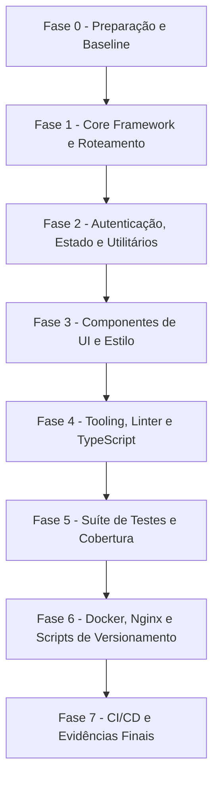

# Guia Genérico — Atualização de Pacotes Frontend (npm / pnpm / yarn)

**Documento:** Guia operacional padronizado e reutilizável para ecossistemas frontend  
**Aplicabilidade:** Projetos SPA, SSR, micro-frontends e SDKs JavaScript/TypeScript (React, Angular, Vue, Vite, Webpack, etc.) gerenciados via `npm`, `pnpm` ou `yarn`.  
**Data:** 2026-08-22  

---

## 1. Objetivo

Padronizar o processo de governança, levantamento, homologação e atualização de dependências em aplicações frontend, assegurando:

- **Estabilidade e Não-Regressão:** Preservar o funcionamento de rotas, componentes visuais, gerenciamento de estado, consumo de APIs backend (REST/GraphQL) e fluxos de autenticação (JWT, MSAL, OAuth2, OIDC).
- **Coesão do Ecossistema:** Alinhar pacotes centrais de cada ecossistema (React, Angular, etc.) nas versões estáveis coordenadas, respeitando rigorosamente as versões de TypeScript e Node.js suportadas.
- **Segurança Proativa:** Identificar e eliminar vulnerabilidades em dependências diretas e transitivas (`npm audit --omit=dev`), utilizando overrides/resolutions de forma controlada quando necessário.
- **Reprodutibilidade Determinística:** Manter o arquivo de lock (`package-lock.json`, `pnpm-lock.yaml` ou `yarn.lock`) 100% íntegro e sincronizado com o manifesto (`package.json`).
- **Automação de CI/CD e Qualidade:** Garantir compilação limpa em modo de produção (`build:prod`), linting sem warnings bloqueantes, execução determinística de testes unitários/integração e geração otimizada de bundles.

---

## 2. Escopo e Não Escopo

### 2.1 Escopo

| Categoria | Ação |
| --------- | ---- |
| **Frameworks Core** | Atualizar bibliotecas centrais (`react`, `react-dom`, `@angular/*`, `vue`) e suas tipagens TypeScript (`@types/*`). |
| **Roteamento e Estado** | Atualizar roteadores (`react-router`, `@angular/router`, `@tanstack/router`) e gerenciadores de estado (Redux, NgRx, Zustand, Pinia, Context API). |
| **Autenticação e Segurança** | Atualizar bibliotecas de autenticação (`@azure/msal-*`, `@auth0/*`, `jwt-decode`, `dompurify`). |
| **UI, Componentes e Estilo** | Atualizar bibliotecas de componentes (Bootstrap, React Bootstrap, Material, Tailwind, Lucide, FontAwesome, datepickers, etc.) respeitando `peerDependencies`. |
| **Tooling, Bundlers e Linters** | Alinhar TypeScript, Vite, Webpack, ESLint (Flat Config), Prettier e plugins associados. |
| **Suítes de Teste** | Atualizar runners (Vitest, Jest, Karma), ambientes DOM (`jsdom`, `happy-dom`) e utilitários de asserção (`@testing-library/*`). |
| **Infraestrutura e Servidor** | Atualizar imagens Docker de build e hosting (Node/Nginx), arquivos de configuração (`nginx.conf`) e scripts de versionamento. |

### 2.2 Não Escopo

- Redesign visual amplo ou reescrita arquitetural de componentes não demandada por breaking changes de pacotes.
- Trocas de paradigmas não planejadas (ex.: troca de Webpack para Vite ou migração de framework sem RFC dedicada).
- Modificação de regras de negócio ou contratos de integração com APIs backend.
- Inclusão arbitrária de novas bibliotecas sem justificativa técnica prévia.

---

## 3. Princípios Fundamentais de Governança Frontend

1. **Inventário Obrigatório Prévio:** Jamais atualizar pacotes às cegas. Executar sempre `npm outdated` e `npm audit` para mapear o cenário completo.
2. **Atualização por Blocos Coesos:** Pacotes de um mesmo subsistema tecnológico devem subir juntos (ex.: toda a família React na mesma release; plugins do Vite alinhados ao core do Vite; suíte Vitest/Testing Library coordenada).
3. **Respeito aos Ranges de Node.js e TypeScript:**
   - O campo `engines.node` no `package.json` deve refletir as versões suportadas e estar rigorosamente alinhado aos ambientes locais, Dockerfiles e esteiras de CI/CD.
   - O compilador TypeScript deve respeitar as travas de compatibilidade do linter (`typescript-eslint`) e do bundler.
4. **Lockfile Íntegro e Sincronizado:** O arquivo `package-lock.json` deve sempre ser commitado juntamente com o `package.json`. Em ambientes de CI/CD e testes locais a partir do zero, utilizar estritamente `npm ci`.
5. **Uso Consciente de Overrides:** A seção `overrides` do `package.json` deve ser reservada para sanear vulnerabilidades transitivas críticas ou resolver impedimentos de peer dependencies enquanto releases oficiais upstream estão pendentes.
6. **Isolamento de Branches:** Todo ciclo de atualização deve ser realizado em branch dedicada (ex.: `chore/update-packages-frontend-YYYY-MM`), com validações a cada fase.
7. **Análise de Breaking Changes em Major Bumps:** Atualizações de versão maior exigem estudo prévio do changelog, migração dirigida de APIs descontinuadas e execução de suítes de teste.

---

## 4. Fase de Inventário

Comandos universais para auditoria do projeto frontend:

```powershell
# Verificar versão do runtime Node e gerenciador npm
node --version
npm --version

# Mapear pacotes com atualizações disponíveis
npm outdated

# Identificar vulnerabilidades em dependências de produção
npm audit --omit=dev

# Identificar vulnerabilidades gerais (incluindo desenvolvimento)
npm audit

# Listar árvore de pacotes de nível superior
npm ls --depth=0
```

Matriz de Conjunto Homologado Frontend:

| Pacote | Tipo (prod / dev) | Versão Atual | Latest Estável | Versão a Aplicar | Justificativa se retido |
| ------ | ----------------- | ------------ | -------------- | ---------------- | ----------------------- |

---

## 5. Estruturação dos Blocos Homologados Frontend

- **Bloco A — Core Framework & Roteamento:** Framework base (`react`, `react-dom`, `@angular/core`, etc.), tipagens fundamentais (`@types/react*`) e roteador principal (`react-router`, `@angular/router`).
- **Bloco B — Autenticação, Estado e Utilitários:** SDKs de autenticação (`@azure/msal-*`, etc.), clientes HTTP (`axios`), bibliotecas de manipulação de datas e utilitários de segurança (`dompurify`).
- **Bloco C — Componentes Visuais e Estilo:** Frameworks CSS/componentes (`bootstrap`, `react-bootstrap`, `tailwindcss`), ícones (`lucide-react`, `react-icons`, `@fortawesome/*`) e seletores de data/hora.
- **Bloco D — Tooling, Linter e TypeScript:** Bundlers (`vite`, `webpack`), compiladores (`typescript`), linters (`eslint`, `typescript-eslint`, plugins React/Angular) e formatadores.
- **Bloco E — Suíte de Testes e Qualidade:** Frameworks de teste (`vitest`, `jest`), adaptadores DOM (`jsdom`), utilitários de asserção (`@testing-library/*`, `@testing-library/jest-dom`) e geradores de cobertura (`@vitest/coverage-v8`).

---

## 6. Plano de Execução por Fases



- **Fase 0 — Preparação e Baseline:** Criar branch isolada; auditar `npm outdated` / `npm audit`; executar `npm test` e `npm run build` para registrar baseline verde.
- **Fase 1 — Core e Roteamento:** Atualizar Bloco A; ajustar imports e APIs de roteamento conforme novas releases.
- **Fase 2 — Autenticação e Utilitários:** Atualizar Bloco B; validar autenticação e compatibilidade com APIs backend.
- **Fase 3 — UI e Estilo:** Atualizar Bloco C; inspecionar componentes visuais e estilos para garantir ausência de quebras de layout.
- **Fase 4 — Tooling e Linters:** Atualizar Bloco D; rodar `npm run lint` e ajustar configurações de ESLint / TypeScript.
- **Fase 5 — Testes e Cobertura:** Atualizar Bloco E; executar `npm test` e certificar 100% de suites e testes verdes.
- **Fase 6 — Docker e Scripts:** Atualizar imagens base em Dockerfiles (`node:alpine`, `nginx:alpine`), revisar `nginx.conf` e scripts de automação.
- **Fase 7 — CI/CD e Evidências:** Alinhar pipelines de integração contínua e gerar relatório consolidado de conclusão.

---

## 7. Checklist de Validação Frontend

```powershell
# 1. Instalação determinística a partir do lockfile
npm ci

# 2. Análise estática e linting
npm run lint

# 3. Execução da suíte completa de testes automatizados
npm test

# 4. Compilação de produção
npm run build:prod    # ou npm run build

# 5. Auditoria de vulnerabilidades
npm audit --omit=dev

# 6. Teste de execução local (smoke test)
npm run dev
```

- [ ] `npm ci` concluído sem erros de peer dependencies (`ERESOLVE`).
- [ ] `npm run lint` concluído com 0 erros.
- [ ] 100% dos testes unitários/integração passando sem falhas.
- [ ] Compilação de produção gera bundles em `dist/` ou `build/` sem erros de tipagem `tsc`.
- [ ] `npm audit --omit=dev` reporta 0 vulnerabilidades High ou Critical em dependências de produção.
- [ ] Servidor de desenvolvimento inicializa e responde nas rotas principais da aplicação.

---

## 8. Infraestrutura, Docker, Nginx e CI/CD

| Componente | Itens de Verificação |
| ---------- | -------------------- |
| **Dockerfile** | Imagens base atualizadas (`node:<LTS>-alpine`, `nginx:<stable>-alpine`); build multi-stage otimizado; usuário non-root quando aplicável. |
| **nginx.conf** | Configuração de roteamento SPA (`try_files $uri $uri/ /index.html;`), compressão gzip e headers de segurança (`X-Content-Type-Options`, `X-Frame-Options`, `Content-Security-Policy`). |
| **Scripts de Versionamento** | Scripts de injeção de versão (`bump-ui-version` / CalVer) operando sem divergências em build local e container. |
| **Pipelines CI/CD** | Tasks de instalação de Node (`NodeTool@0`, `actions/setup-node`) alinhadas com `engines.node`. |

---

## 9. Evidências Obrigatórias da Entrega

Ao término do ciclo de atualização, consolidar as seguintes informações:

1. **Matriz de Pacotes Atualizados:** Tabela com versões anteriores, versões aplicadas e justificativas de pacotes retidos.
2. **Relatório Métrico de Qualidade:**
   ```text
   Pacotes de produção atualizados: N
   Pacotes de desenvolvimento atualizados: N
   Suítes / Testes executados: N / N (100% aprovados)
   Vulnerabilidades de produção resolvidas: N (Total restante: 0)
   Status da compilação de produção: Sucesso (0 erros)
   ```
3. **Lista de Arquivos Modificados:** `package.json`, `package-lock.json`, Dockerfiles, configs de linter/testes e pipelines.

---

## 10. Plano de Rollback Frontend

Em caso de impedimento crítico durante a validação:

```powershell
# Reverter para o commit baseline
git checkout <branch-do-ciclo>
git reset --hard <commit-baseline>

# Reinstalar dependências originais do lockfile
npm ci

# Validar estado restaurado
npm test
npm run build
```

---

## 11. Riscos Recorrentes e Estratégias de Mitigação

| Risco | Impacto | Estratégia de Mitigação |
| ----- | ------- | ----------------------- |
| **Conflito de Peer Dependencies (`ERESOLVE`)** | Falha no `npm install` | Subir pacotes interdependentes no mesmo commit; utilizar `overrides` apenas com justificativa documentada. |
| **Divergência entre TypeScript e Linter** | Erros de parser no ESLint | Manter a versão de TypeScript alinhada ao range aceito pelo `typescript-eslint`. Se necessário, utilizar compilação side-by-side. |
| **Breaking changes de Roteamento** | Quebra de links e navegação SPA | Ler changelog de migração (ex.: `react-router` v7/v8) e atualizar imports e hooks correspondentes. |
| **Lockfile dessincronizado** | Falha de compilação em CI/CD | Sempre commitar `package-lock.json` junto com `package.json`; validar via `npm ci`. |
| **Vulnerabilidades em dependências transitivas** | Alerta em relatórios de segurança | Mapear pacote causador com `npm ls <nome>` e aplicar override pontual na versão segura. |

---

## 12. Modo de Execução Recomendado (para IA / Agentes / Automações)

1. **Inventário:** Executar `npm outdated` e `npm audit` registrando o estado inicial.
2. **Homologação:** Propor a matriz de pacotes homologados e validar contra as diretrizes do projeto.
3. **Aplicação por Fases:** Atualizar blocos de forma incremental, testando com `npm test` e `npm run build` a cada fase.
4. **Saneamento de Segurança:** Verificar `npm audit --omit=dev` e aplicar overrides pontuais se necessário.
5. **Encerramento:** Validar Docker, scripts de versionamento, emitir evidências no relatório e submeter para revisão.
